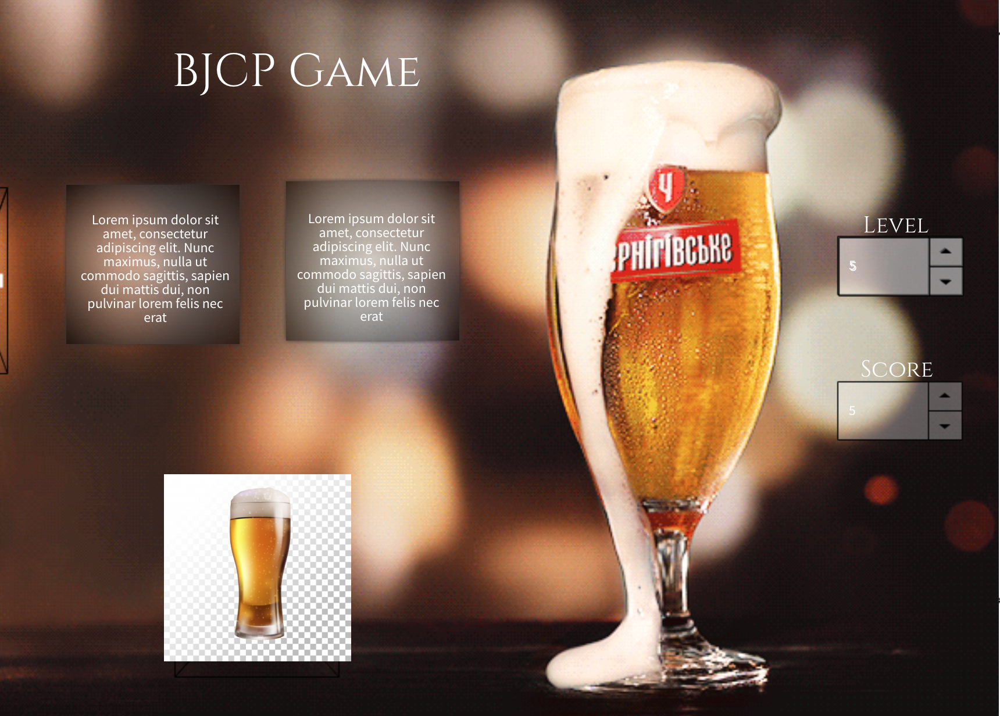

BJCP STYLE MEMORY GAME

===============================
GAME PURPOSE: 
The purpose of this game is to assist with the BJCP standards for Cicerone (or just for fun!). 
The game will start out as a "memory" type game that can be one player. 

For level 1, The player will be given 1 question and 2 beer choices. The player will need to figure out which beer is correct.

If the beer is picked correctly, then the player will score a point. The player can then move on to the next beer question, which will be at random. 
If the beer is picked incorrectly, the player will be given a chance to start over to continue player. No point will be scored.

If the player completes all the questions correctly, they can move on to the next level.
===============================
GAME LEVELS:
ABV comparison of lowest possible ABV% <-- minimum viable product, lvl 1
Beer Color (12 colors) <-- lvl 2
Beer Style (34 styles) <-- lvl 3
Beer Fermentation (6 ways) <--  lvl 4
Origin (6 origin locations) <-- lvl 5
===============================
CODING OBJECTIVES
start game button
create an object for all of the beer (this will be to call for the origin at later levels)
have a question box that will rotate questions in and out (for later levels)
create a timer for the level
create 2 possible answers
have a points board
have a levels board
utilize bootstrap
utilize velocity for the categories. different velocity options if the answer is right vs wrong
utilize velocity for the question box
game reset button
===============================
